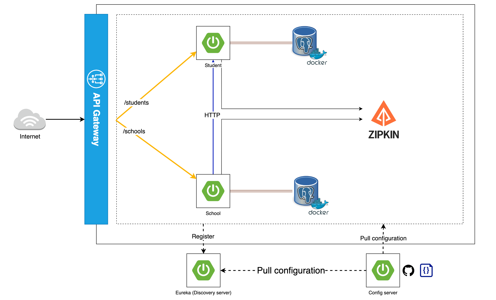

# Microservices Demo Project




This repository contains a demo project showcasing a microservices-based application, designed to provide a hands-on understanding of microservices architecture and implementation. The project consists of an API Gateway, Config Server, Discovery Server, and two microservices: Student and School.

## Table of Contents

- [Getting Started](#getting-started)
    - [Prerequisites](#prerequisites)
    - [Installation](#installation)
- [Project Components](#project-components)
    - [API Gateway](#api-gateway)
    - [Config Server](#config-server)
    - [Discovery Server](#discovery-server)
    - [Student Microservice](#student-microservice)
    - [School Microservice](#school-microservice)
- [Inter-Service Communication](#inter-service-communication)
    - [Using OpenFeign](#using-openfeign)
- [Distributed Tracing](#distributed-tracing)
    - [Using Zipkin](#using-zipkin)
- [Contributing](#contributing)
- [License](#license)
- [Contact](#contact)
- [Acknowledgements](#acknowledgements)

## Getting Started

Follow the instructions below to set up the project on your local machine for development and testing purposes.

### Prerequisites

Ensure you have the following software installed on your system before proceeding:

- Java Development Kit (JDK) 17 or later
- Maven
- Docker (optional, for containerization)

### Installation

1. Clone the repository:

```git clone git remote add origin git@github.com:ali-bouali/springboot-3-micro-service-demo.git```

2. Navigate to the project directory:
3. Build and package each component with Maven:


## Project Components

### API Gateway

The API Gateway serves as the single entry point for all client requests, managing and routing them to the appropriate microservices.

### Config Server

The Config Server centralizes configuration management for all microservices, simplifying application maintenance and consistency across environments.

### Discovery Server

The Discovery Server provides service registration and discovery, enabling seamless service-to-service communication within the microservices ecosystem.

### Student Microservice

The Student Microservice is responsible for managing student-related data and operations, such as adding, updating, and retrieving student records.

### School Microservice

The School Microservice manages school-related data and operations, including adding, updating, and retrieving school records.

## Inter-Service Communication

### Using OpenFeign

This project demonstrates inter-service communication using OpenFeign, a declarative REST client that simplifies service-to-service communication within the microservices ecosystem.

## Distributed Tracing

### Using Zipkin

The project showcases the use of Zipkin for distributed tracing, enhancing application observability and enabling the visualization and troubleshooting of latency issues.

## Contributing

Contributions are welcome! Please read our [CONTRIBUTING.md](CONTRIBUTING.md) for details on how to contribute to this project.

## License

This project is licensed under the [MIT License](LICENSE).

## Acknowledgements

- [OpenFeign](https://github.com/OpenFeign/feign)
- [Zipkin](https://zipkin.io/)
- [Spring Cloud Netflix](https://spring.io/projects/spring-cloud-netflix)
